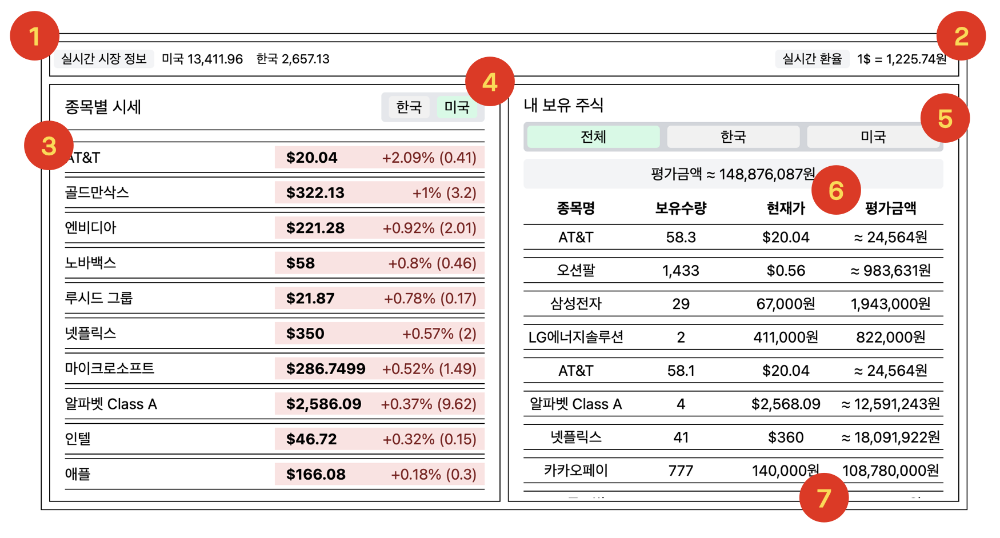

# Dashboard

## 화면 구성

### 1. Header
- 실시간 시장 정보
  - API:  `/info/*countryCode*`
  - 소켓 구독: `INFO`
    - 구독 시 useQuery에 캐싱된 데이터 업데이트
- 실시간 환율
  - API: `/rate`
  - 소켓 구독: `RATE` 소켓
    - 구독 시 useQuery에 캐싱된 데이터 업데이트

### 2. 종목별 시세
- 국가 선택(countrySelector)
  - 디자인 시스템의 countrySelector 이용
  - 국가 변경 시 UX를 고려하여 Suspense로 Loading Spinner 표기
- 시세 데이터
  - API: `/stock-price`와 `/closed-price`
    - 최초 로딩이나 국가 선택 시 재호출
    - 재호출 시 가격 변동률을 기준으로 **병합정렬** - 정렬 성능을 개선하기 위해 병합정렬 선택
  - 소켓 구독: `PRICE` 소켓 구독을 통해 현재 가격 업데이트
    - 변경된 가격 데이터는 내 보유 주식과 공유해야 하므로 realtimeStocksContext에 저장
  - 국가 변경 시, 두 API 모두 패치가 완료된 후 렌더링이 다시 일어나도록 처리
    - Suspense를 다시 호출할 수 있도록 `keepPreviousData` 옵션 false 처리

### 3. 내 보유 주식
- 국가 선택(countrySelector)
  - 디자인 시스템의 countrySelector 이용
  - 국가 변경 시 UX를 고려하여 Suspense로 Loading Spinner 표기
- 보유 주식
  - API: `/assets`, `/assets/*countryCode*`
  - 소켓 구독: `NEW_TRADE` 소켓을 구독하여 보유수량 업데이트
    - 기존에 존재하지 않는 주식 데이터인 경우, `/assets` API를 useQuery를 invalidate 하여 다시 패치하도록 처리
  - `PRICE` 소켓 구독을 통해 현재 가격 업데이트
    - 종목별 시세 목록에 데이터가 존재하지 않을 수 있으므로 별도로 Hook을 실행하지만, 성능을 고려하여 기존에 구독 중인 항목이면 실제 구독 요청이나 messageHandler 가 추가되지 않도록 처리
  - 실시간 환율에서 사용한 useQuery의 캐시 값과 보유수량, 현재가를 이용하여 평가금액 결정
